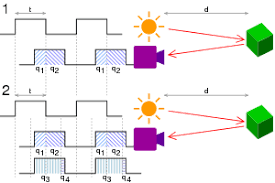
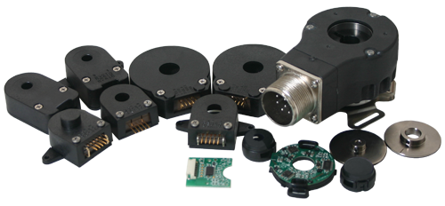
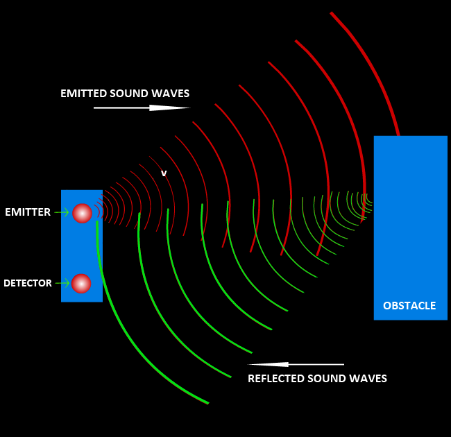
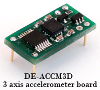
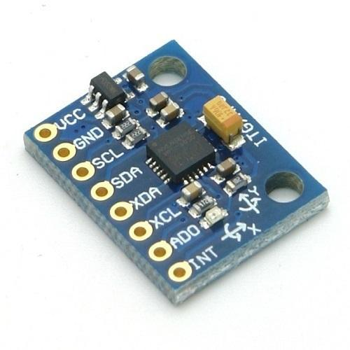
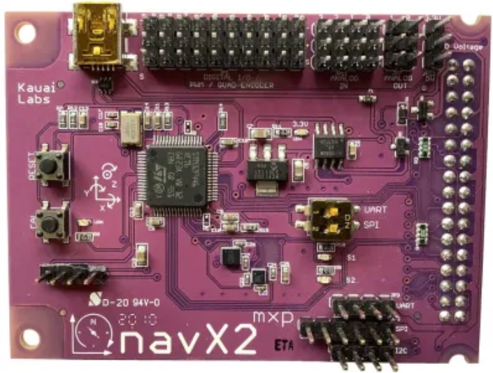

# Intro to Sensors

So now you have the basic sense of what electronics does and have looked at some of the tools that they use. Very nice. Now you can look at one of the most important aspects of Electronics: dealing with sensors. There are a myriad of things you can do with sensors and there are many different types of sensors. There are a lot of sensors and we will never use all of them at one time when making a robot, let alone do everything we possibly can with them at one time. However, there are some sensors you should know about and other pieces of info that you should know when dealing with sensors in electronics. Lets take a look.

### LiDAR

A LiDAR(Light Detection And Ranging) sensor emits pulsed light waves into the surrounding environment. The pulses bounce off the objects and return to the sensor. Then, the sensor calculates the time it took to create an estimate of what objects look like and where they are (think echolocation but with lasers light pulses).

These are useful for measuring the distances between the sensor and the object. For example, it can be equipped on drones to survey the terrain and create a 3d model.

*Example of LiDAR Model*

Using LiDAR can get you precise data quickly (It repeats millions of processes at once to create an accurate 3D map on a computer). Not only that, but the lasers are eye-safe so no one's getting hurt looking at a sensor.

Look into LiDAR more with the following links:

- ["What is LiDAR" Article](https://oceanservice.noaa.gov/facts/lidar.html)
- [More about LiDAR](https://velodynelidar.com/what-is-lidar/)
- [Basics of LiDAR](https://www.neonscience.org/resources/learning-hub/tutorials/lidar-basics)

### Optical Encoders

Optical Encoders are made up of four components: a light source, a sensor, a movable disk, and a fixed mask. Rotary encoders use a sensor to identify position change as light passes through a patterned encoder wheel or disk. It detects when light has passed through or not, with the rate of light passing through and being blocked being measured. Forces such as velocity, rotation, and position can be measured using an optical encoder.

*Example of an Optical Encoder*

Can measure multiple types of motion. For example, the speed of a wheel on a car or robot can be measured. The rate at which the light is allowed through and is blocked is measured, providing for the speed of the wheel.

Though this can account for precise motion measurement, it has problems with debris and environments (light, smoke). This is because it can make it harder for light to be detected from the sensor.
### Magnetic Encoders

A magnetic encoder is made up of three major components: a sensing circuit, a rotating wheel, and magnetic poles (north+south) spaced evenly around the wheel.

*Parts for Magnetic Encoders*

The encoder works by placing tiny north and south poles evenly around a rotating wheel. A sensor is then used to detect the tiny changes in magnetic direction, giving feedback on rotary information. Uses either hall effect or magneto resistive detection.

*Example of Magnetic Encoder*

The spinning wheels cause a response in the sensor based on the changes in magnetic direction. The response goes through a circuit and is displayed as a digital signal on a device. Can be used for measuring rotational motion on items such as wheels.

These encoders are very accurate and reliable and produce high resolution, low cost feedback. It also cannot be contaminated by dirt and moisture unlike optical encoders. However, it is susceptable to interference with other magnets.

Look into optical and magnetic encoders more with the following links:

- [Encoders Info](https://www.anaheimautomation.com/manuals/forms/encoder-guide.php)
- [Magnetic VS Optical Encoders](https://www.dynapar.com/technology/optical-encoders/)

### Hall Effect Sensors

A hall effect sensor is a type of sensor that measures magnetism. Electricity is moved through a semi-conductive material, such as silicon, in a straight line. When a magnetic field is introduced, the electrons moving through the material deviate from their straight line and move to a positive or negative pole (being attracted or repelled) on the material. The changes in voltage that come from the new curved electricity path is then measured.

*Example of Hall Effect Sensor*

Hall effect sensors are used to detect the motion of an object. For example, the position of a motor can be sensed by measuring the slight change in the magnetic field as the motor rotates. Hall effect sensors are also used in some magnetic encoders, as a sensor is required to detect the changes in magnetic fields on the disk.

Look into hall effect sensors more with the following links:

- [Basics of the Hall Effect](https://www.explainthatstuff.com/hall-effect-sensors.html)
- [What is a Hall Effect Sensor?](https://se.rs-online.com/web/generalDisplay.html?id=ideas-and-advice/hall-effect-sensors-guide)
- [Hall Effect Sensor Applications](https://sensing.honeywell.com/honeywell-sensing-sensors-magnetoresistive-hall-effect-applications-005715-2-en2.pdf)

### Ultrasonic Sensors

Ultrasonic sensors measure distance by using ultrasonic waves. The sensor head emits an ultrasonic wave and receives the wave that is reflected back. They measure distance by calculating time between emission and the reception, very similar to echolocation.

*Example of Ultrasonic Senor in Action*

Ultrasonic sensors are used to measure the distance between the sensor and an object. We used it in an arduino lesson, where we took the output from this sensor and displayed the measured distance to the console. Check [this](https://docs.google.com/presentation/d/19o4NYb6BRZlHKXEtQFi8vAW7o6CekYDQpzCjqVORx2g/edit#slide=id.p) lesson out. 

*Example of Ultrasonic Sensor*

Be sure to research more about Ultrasonic sensors here:

- [What is an Ultrasonic Sensor](https://www.keyence.com/ss/products/sensor/sensorbasics/ultrasonic/info/)
- [Comparison between Ultrasonic Sensors and Optical Sensors](https://www.keyence.com/ss/products/sensor/sensorbasics/ultrasonic/comparison/)
- [What is an Ultrasonic sensor?](https://www.fierceelectronics.com/sensors/what-ultrasonic-sensor)

### Potentiometers

Potentiometers are adjustable rotary analog devices that can also act as variable resistors, which can change resistance with a dial. Potentiometers measure current, which is proportional to the distance. It uses a wiper to adjust the resistance (between 2 out of the three pins) of the potentiometer. The outside pings are the voltage and ground pins, while the inside (middle) pin is the resistive measurement.

*Example of potentiometer*

These are usually used to control speed, voltage, or frequency using a dial that you can rotate. This makes it easy to adjust anything using power whether it be the brightness of a light or the speed at which the intake runs.

*Example of adjusting dial*

Potentiometers have reliable output and are also very effiecent at measuring large displacements. It also has the unique ability to vary it's resistance, meaning that it is an analog sensor (wide range of inputs).

To learn more about potentiometers, check out the links here:

- [Potentiometers](https://www.electronics-tutorials.ws/resistor/potentiometer.html)
- [What is a Potentiometer](https://eepower.com/resistor-guide/resistor-types/potentiometer/#)

### Photoelectric Sensors

The photoelectric sensor is a light based sensor. There is an emitter emitting light to a receiver. If the receiver does not see the light beam emitted from the emitter (the light beam is blocked), it detects an object. The light beam is typically infrared light. A specific sensor of this type would be a beam break sensor.

*Example of photoelectric sensor*

Photoelectric sensors can detect the presence or absence of an object in the light beam’s pathway, the location of nearby and faraway objects, and changes in lighting. They can also detect any item regardless of material, including glass.

To learn more about photoelectric sensors, check out the links here:

- [Photoelectric Sensors Overview](http://www.ia.omron.com/support/guide/43/introduction.html)
- [Applications of Photoelectric Sensors](https://www.rs-online.com/designspark/seven-uses-for-photoelectric-sensors)

### Limit Switches

A limit switch is a mechanical device operated by a physical force applied by an object that detects the presence or absence of an object. It consists of an actuator which transfers external force to the built in switch. When pressed, the electrical circuit is either closed/opened.

*Example of a limit switch*

Limit switches can be used as a simple control or lock system. Items that also require a stop button due to a limited range of movement can also use a limit switch. For example, on 3D printers the x and y carriages have limit switches on them to prevent them from moving too far and breaking the machine. Limit switches are liked due to their small and simple design, inexpensiveness, and and sturdiness (can last for many clicks). 

*Example of the design of a limit switch*

To learn more about limit switches, check out the links here:

- [Limit Switches](https://www.eaton.com/ecm/groups/public/@pub/@electrical/documents/content/pct_1549250.pdf)
- [Limit Switches Explained](https://realpars.com/limit-switch/)
- [Technical Explanation for Limit Switches](https://www.ia.omron.com/data_pdf/guide/30/limitswitch_apparatus_tg_e_3_2.pdf)

### Magnetometers

This sensor measures the strength and sometimes the direction of the magnetic fields. It also can be used to calibrate magnets to determine magnetization of materials. There are two types of magnetometers (classified by their calibration methods):
- Scalar magnetometers
- Quality of attractive fields
- Vector magnetometers
- Direction of heading

*Example of a magnetometer*

Magnetometers are used to measure values such as the earth’s magnetic field. They can detect other magnets in the vicinity and give feedback on them. If an FRC game piece has a magnet in them, you can detect it!

To learn more about magnetometers, check out the links here:

- [Magnetometers](https://www.britannica.com/technology/magnetometer)
- [what is a Magnetometer](https://www.toppr.com/guides/physics/mechanics/what-is-magnetometer-and-how-does-it-work/)

### Accelerometers

Any motion, even the force of gravity, can be detected by accelerometers. A small bit of silicon detects vibration/force applied to it.

*Example of an accelerometer*

Accelerometers are used to detect linear motion (acceleration of an object, hence the name, accelerometer). Such motions include an increase/decrease in speed, sharp turns, strong impacts, bumps and vibrations. They can also find out the angle the device is tilted at with respect to the earth by measuring the amount of static acceleration due to gravity. By combining multiple accelerometers, you can get more axes of information (not just linear motion, but for pitch or yaw).

To learn more about accelerometers, check out the links here:

- [A Beginner's Guide to Accelerometers](https://www.dimensionengineering.com/info/accelerometers)
- [What is an Accelerometer](https://www.livescience.com/40102-accelerometers.html)

### Gyroscopes

A gyroscope sensor is a device that can measure and maintain the orientation and angular velocity of an object. It is more advanced than an accelerometer because it can measure tilt and lateral orientation.

*Example of a gyroscope*

Gyroscopes can be used to to measure the 3 dimensional movement (pitch, yaw, roll) of an object as well as detect motion in many different directions and angles:

To learn more about gyroscopes, check out the links here:

- [How Gyroscopes Work](https://www5.epsondevice.com/en/information/technical_info/gyro/)
- [Gyroscope Applications](https://www.elprocus.com/gyroscope-sensor/)

### NavX Sensors

The NavX sensor bundle is a combination of a magnetometer, accelerometer, and gyroscope It can be used to detect many types of motion and get information regarding the orientation and position of the robot.

*Example of NavX2 sensor bundle*

The NavX is space-effiecent and can measure various types of distances and angles. It can also be used to find the speed and orientation of objects. Though this is a powerful sensor bundle, if you do not need every sensor that comes with it, it may be better to use separate sensors instead.
