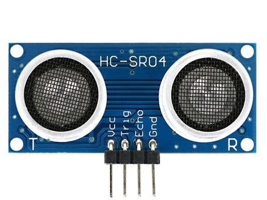

# Intro to Sensors

So now you have the basic sense of what electronics does and have looked at some of the tools that they use. Very nice. Now you can look at one of the most important aspects of Electronics: dealing with sensors. There are a myraid of things you can do with sensors and there are many different types of sensors. There are a lot of sensors and we will never use all of them at one time when making a robot, let alone do everything we possibly can with them at one time. However, there are some sensors you should know about and other pieces of info that you should know when dealing with sensors in electronics. Lets take a look.

### LiDAR

A LiDAR(Light Detection And Ranging) sensor emits pulsed light waves into the surrounding environment. The pulses bounce off the objects and return to the sensor. Then, the sensor calculates the time it took to create an estimate of what objects look like and where they are (think echolocation but with lasers light pulses).

These are useful for measuring the distances between the sensor and the object. For example, it can be equipped on drones to survey the terrain and create a 3d model.

*Example of LiDAR Model*

Using LiDAR can get you precise data quickly (It repeats millions of processes at once to create an accurate 3D map on a computer). Not only that, but the lasers are eye-safe so no one's getting hurt looking at a sensor.

Look into LiDAR more with the following links:

- ["What is LiDAR" Article](https://oceanservice.noaa.gov/facts/lidar.html)
- [More about LiDAR](https://velodynelidar.com/what-is-lidar/)
- [Basics of LiDAR](https://www.neonscience.org/resources/learning-hub/tutorials/lidar-basics)

### Optical Encoders

Optical Encoders are made up of four components: a light source, a sensor, a movable disk, and a fixed mask. Rotary encoders use a sensor to identify position change as light passes through a patterned encoder wheel or disk. It detects when light has passed through or not, with the rate of light passing through and being blocked being measured. Forces such as velocity, rotation, and position can be measured using an optical encoder.

*Example of an Optical Encoder*

Can measure multiple types of motion. For example, the speed of a wheel on a car or robot can be measured. The rate at which the light is allowed through and is blocked is measured, providing for the speed of the wheel.

Though this can account for precise motion measurement, it has problems with debris and environments (light, smoke). This is because it can make it harder for light to be detected from the sensor.
### Magnetic Encoders

A magnetic encoder is made up of three major components: a sensing circuit, a rotating wheel, and magnetic poles (north+south) spaced evenly around the wheel.

*Parts for Magnetic Encoders*

The encoder works by placing tiny north and south poles evenly around a rotating wheel. A sensor is then used to detect the tiny changes in magnetic direction, giving feedback on rotary information. Uses either hall effect or magneto resistive detection.

*Example of Magnetic Encoder*

The spinning wheels cause a response in the sensor based on the changes in magnetic direction. The response goes through a circuit and is displayed as a digital signal on a device. Can be used for measuring rotational motion on items such as wheels.

These encoders are very accurate and reliable and produce high resolution, low cost feedback. It also cannot be contaminated by dirt and moisture unlike optical encoders. However, it is susceptable to interference with other magnets.

Look into optical and magnetic encoders more with the following links:

- [Encoders Info](https://www.anaheimautomation.com/manuals/forms/encoder-guide.php)
- [Magnetic VS Optical Encoders](https://www.dynapar.com/technology/optical-encoders/)

### Hall Effect Sensor

A Hall effect sensor is a type of sensor that measures magnetism. Electricity is moved through a semi-conductive material, such as silicon, in a straight line. When a magnetic field is introduced, the electrons moving through the material deviate from their straight line and move to a positive or negative pole (beling attracted or repelled) on the material. The changes in voltage that come from the new curved electricity path is then measured.

*Example of Hall Effect Sensor*

Hall effect sensors are used to detect the motion of an object. For example, the position of a motor can be sensed by measuring the slight change in the magnetic field as the motor rotates. Hall effect sensors are also used in some magnetic encoders, as a sensor is required to detect the changes in magnetic fields on the disk.

Look into hall effect sensors more with the following links:

- [Basics of the Hall Effect](https://www.explainthatstuff.com/hall-effect-sensors.html)
- [What is a Hall Effect Sensor?](https://se.rs-online.com/web/generalDisplay.html?id=ideas-and-advice/hall-effect-sensors-guide)
- [Hall Effect Sensor Applications](https://sensing.honeywell.com/honeywell-sensing-sensors-magnetoresistive-hall-effect-applications-005715-2-en2.pdf)

### Ultrasonic

Ultrasonic sensors measure distance by using ultrasonic waves. The sensor head emits an ultrasonic wave and receives the wave that is reflected back. They measure distance by calculating time between emission and the reception, very similar to echolocation.

*Example of Ultrasonic Sensor*

Ultrasonic sensors are used to measure the distance between the sensor and an object. We used it in an arduino lesson, where we took the output from this sensor and displayed the measured distance to the console. Check [this](https://docs.google.com/presentation/d/19o4NYb6BRZlHKXEtQFi8vAW7o6CekYDQpzCjqVORx2g/edit#slide=id.p) lesson out. 

###