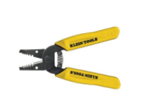
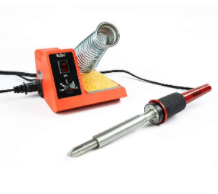
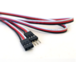

# Tools

#### Wire Stripper
 The wire stripper is used to strip the wires of the outer plastic insulator. To use this, first find 
 the gauge of the wire and place the wire into the appropriate groove. Then, squeeze the wire stripper
 like a scissor and pull on the wire to remove the plastic insulation. If you’re having trouble removing 
 the plastic, try going down one gauge and try again. You can find the specific instructions in this 
 link: https://www.youtube.com/watch?v=fDo-KbKRd4A.

#### Soldering Iron
 The soldering iron is used to join two or more items together with solder (melted metal). To use this,
 first heat up the soldering iron and obtain some solder. Second, Carefully use the heated tip of the soldering 
 iron to melt some solder onto the desired area of choice. An example is melting some solder on a wire to join two
 wires together. Make sure to not use too much solder so that the solder forms a solid connection. If desired, cover 
 up the soldered area with heat shrink or electrical tape. The specific instructions is in the link: https://www.youtube.com/watch?v=Qps9woUGkvI.
 

#### Crimper
* Used to combine a connector and a wire together through compression
* Place the stripped ends of the wires you would like to connect inside of the connector
* Find the gauge of the connector and place it into the appropriate groove
* Squeeze like a scissor
* [Specific instructions](https://youtu.be/Svja8zEcKNQ?t=73)

#### Hammer Crimp Tool
* Used to join a metal crimp with a wire
    * Place metal crimp along with the wire inside of the crimp in the bottom “valley” of the tool
    * Start hammering on top of the tool, smushing the metal and creating a solid connection on the wire
    * Make sure to hammer down the whole crimp, it should look uniform when done

#### Multimeter
* Used to measure various values such as voltage, current, and resistance
    * Contains the physical multimeter and 2 probes
    * Note: We only use the DC voltage and resistance values
* How to use:
    * Turn the dial to what value you want to measure, and then plug the cables into the correct holes at the bottom of the multimeter
        * Note: you will always plug a cable into the middle hole, but there are different holes for measuring current/voltage/ohms
    * Put the probes on what you want to measure, make sure you match the ground and positive values correctly on what you are measuring

#### Battery Beak
* Used to check various stats of the battery, including internal resistance, charge %, and general status 
* Make sure that batteries for competition pass these criteria:
    * Resistance (“Rint”) must to be <0.2; ideally, competition grade batteries 
        * Should be around 0.10-0.19
    * “Status” must be “Good” (obv)
    * If charge is not over 100% (ideally 120%, which is the max), make sure to charge them before any competition matches
* For testing the robot and such, you don’t need the full 120% charge.
* For testing, make sure to use crappy batteries that have too high of an internal resistance that they’re not good for comp
* Specific instructions: *Video coming after we get back to the makerspace*

#### Heat Gun
* A very hot hair dryer used to shrink the heat shrink tubing
* Make sure that there are no flammable objects nearby the heat gun when in use

### Utilities

#### Zip Ties
* Ties that zip. Zips that tie.
* Can come in multiple lengths and sizes
* For use when needing a quick way to join objects together
* When the zip ties are too short, you can connect multiple zip ties together to create a “zip tie chain”

#### PWM Cables
* (Pulse Width Modulation)
* Sends signals to microcontrollers with different pulse lengths
* Used to connect certain sensors to the roboRIO (RIO has a couple of PWM ports)

#### CAN Wires
* Controller Area Network
* llows microcontrollers to communicate with each without a computer (roboRIO).
* Used to connect RoboRIO, PCM, speed controllers, PDP

#### Anderson Connectors (mini and regular)
* Used to connect wires to one other through small insulated housings
* Can also be used as the connecting plug from the battery to the robot
    * Place the stripped ends of the wires you would like to connect in the metal Anderson contact
    * Crimp the wire to the contact securely for good circuit connection
    * Fit/slide the wire and metal contact into the connector housing 
* [Specific instructions](https://www.youtube.com/watch?v=QzLvdR6X81k)

#### Electrical Tape 
* Used to cover/insulate exposed wires
    * Patches up and secures small wire-connected areas
* General all-purpose use
* Tip: you can color code the positive and ground with red and black tape :D

#### Heat Shrink Tubing
* This tubing is a useful alternative to electrical tape
* Once heated up, the tubing shrinks around the wire and provides insulation and some protection from the environment 
* There’s different diameters of tubing, so make sure to choose the  correct size for different wire gauges 

