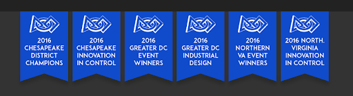

## What is FIRST Robotics?

FIRST (For Inspiration and Recognition of Science and Technology) Robotics is an organization that holds international high school robotics competitions.
Each year, teams of students are challenged to raise funds, design a team brand, and engineer an industrial-sized robot to compete in a field game against other teams.
Teams can also have mentors, who are professionals that volunteer and lend their expertise to guide the team.

!!! quote ""
    *“It’s as close to real-world engineering as a student can get.”*

    \- FIRST Website

## What Is The First Robotics Competition?

### History

The FIRST Robotics Competition was founded in 1989 by inventor and entrepreneur Dean Kamen and retired MIT professor Woodie Flowers.
Dean Kamen was unhappy with the number of women and minorities who did not consider STEM (Science, Technology, Engineering, Mathematics) careers.
The first competition season was held in 1992.

*Woodie Flowers (left) and Dean Kamen (right).*

### FRC Pathway

The FIRST Organization also holds competitions for students of varying ages. These include the...

1. FIRST Lego League Junior: grades K-4
2. FIRST Lego League (FLL): grades 4-8
3. FIRST Tech Challenge (FTC): grades 7-12
4. FIRST Robotics Challenge  (FRC): grades 9-12 (that's us!)

### Events

There are two competition models which a team can opt into: regional and district competitions.

**Regionals:** Teams begin by signing up for and competing in one or more regional competitions.
Any team can attend a regional, and it usually houses 40-70 teams.
By winning regionals, each team in the winning alliance (group of three teams) receives a ticket to the championships.
(We use the regional model.)

**District:** Compared to regionals, district competitions are smaller in scale, and entry is limited by geographic location.
Instead of the winners ascending to the championships, teams compete for points in district competitions.
Those with the most points attend the district championship event, and teams with the most points receive tickets to the championships.
District competitions are more abundant and are cheaper than regionals, and teams are able to attend more events and play more matches.

**Championships:** Teams from all over the world meet at the championship event and compete.
The winner is automatically given a ticket to the next year’s championship. Past championships were held in cities such as Houston, Detroit, and St. Louis.

Competition events will oftentimes include extra activities for members to participate in. These include **workshops and panels**, where students and mentors present and discuss FRC related topics.
Competition is also expensive (transportation, food, housing, sign-up fees, etc.), so teams spend time fundraising throughout the year.  

Winners for both regional and championship competitions, as well as select awards are awarded with a blue banner.

#### Other Events

Community Events: Aside from regional and championship events, members in the community also hold their own competition events. Examples include...

1. Chezy Champs, hosted by Team 254 (Bellarmine College Preparatory, San Jose)
2. MadTown Throwdown, hosted by Team 1323 
3. CalGames, hosted by the Western Regional Robotics Forum

!!! note "Fun Fact"
    During the 2019 season, nearly 100,000 high school students on 3,940 FIRST Robotics Competition teams will compete in 100 District Events, 11 District Championships, and 62 Regional Events.

## FIRST Philosophies & Core Values

FIRST has two main philosophies which it encourages its members to adopt not only during the time they spend in the program, but into their own lives. 

### Gracious Professionalism (GP)

Gracious Professionalism is a way of doing things that encourages high-quality work, emphasizes the value of others, and respects individuals and the community.
People who practice Gracious Professionalism learn how to both compete fiercely, while also respecting and being kind to others.

!!! quote ""
    *“They avoid treating anyone like losers. Knowledge, competition, and empathy are comfortably blended.”*

    \- FIRST Website

<iframe title="Woodie Flowers explains Gracious Professionalism" width="400" height="225" src="https://www.youtube.com/embed/h2e6gxczMxc" allowfullscreen></iframe>

### Coopertition

Coopertition is displaying unqualified kindness and respect in the face of fierce competition.
The idea is founded on the philosophy that teams can and should help and cooperate with each other even as they compete.
Coopertition involves both learning from and teaching teammates.
It is learning from mentors, both managing and being managed. 

### FIRST Core Values

To learn more about the FRC, check out the FAQ [here](https://firstnevada.org/wp-content/uploads/2019/10/FIRST-HQ-FAQ.pdf).
