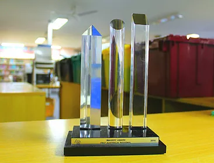

# Aspects of Competition

## At Competition

At competition, the team is typically divided into groups, each contributing differently to the team’s success.

### In the Pits

The pit is an area where teams do robot maintenance between matches. Typically only a few members (dubbed the pit crew and typically from technical departments) are allowed in the pit at a time to prevent overcrowding. Sometimes, matches are closely knit for certain teams, and it should be taken into consideration that members who know what they are doing should do robot maintenance (if necessary) quickly to maximize robot performance during the actual matches, which is why we often see leads and veteran members in pit crew. Other general members not part of pit crew are seen bleacher scouting, pit scouting, or spending leisure time in the pit area.

*Team 253’s pit crew during the 2016 San Francisco Regionals.*

### Drive Team

The drive team is a subgroup of the team that is focused on managing the robot on the field. The traditional drive team consists of a **driver, operator, technician, drive coach**, and **human player**, but the member roles can vary depending on the game. Each member is assigned a specific task. During build season, drive trials are held to determine drive team members.

**Driver and Operator:** The driver controls the robot during matches and the operator works with the driver to score game pieces. Only the driver and operator are allowed to touch the driver station (robot controls) during matches.

**Drive Coach:** The drive coach manages the drive team. Some of their responsibilities include developing match strategies with alliance partners and passing on the information to the rest of the drive team. During matches, the drive coach can guide the driver and operator.

**Technician:** The technician is the drive team’s resource for the troubleshooting and maintenance of the robot on the field. To help them troubleshoot, technicians should have an understanding of the systems that connect the robot to the driver station. This includes the operator console as well as the robot’s electronics, like the radio, roboRIO, and battery. 

**Human Player:** The human player directly interacts with game pieces during matches, with their task varying between games. There can be multiple human players who can be cycled through, but only 1 is allowed per match.

### Scouting

An important part of any team’s success at competition is scouting, where groups of students from one team collect information on other team’s robots. 

**Pit Scouting:** Team scouting usually involves approaching the pit crew of another team and asking a set of questions about their robot. Pit scouting helps the strategy team determine another team's robot's physical capabilities.

**Bleacher Scouting:** Teams will typically send scouters to record information about another team’s performance during matches. Our bleacher scouters are expected to know how to properly bleacher scout and pit scout regardless of what they want or do not want to do. The information taken from bleacher scouting is used by the strategy team to predict opposing team strategy. This is helpful for determining a team’s recent performance, which can change over the course of a competition (for example if a robot suffered a mechanism failure or if the driver was inconsistent).

**Department Scouting:** The process of department scouting is the same as with team scouting, but the purpose differs in that it is done specifically to help departments learn about new techniques and mechanisms that other teams are using. Department scouts use different scouting forms than team scouts.

### Game Strategy

Before a match, the drive teams of an alliance often come together and discuss strategy. This will usually involve assessing what each team should be doing at each stage of the match (auto, teleop, endgame), planning out routes on the field to avoid congestion, and predicting and countering the opposing alliance’s strategy. 

Listed below are some factors taken into account during strategy discussions.

- teams’ strategy in prior matches
- recent team performance
- strengths and weaknesses of robots
- synergy among robots

Much of this information should already be documented in the team’s scouting data before alliance members meet. Our strategy comes together for a strategy discussion before the next alliance strategy discussion where the strategy lead, superscouters, and drive team meet with other teams in future matches to discuss strategy for those matches. Teams should come into an alliance strategy discussion with their own strategy in mind. 

### Alliance Selection

After an initial set of qualification matches, teams participate in alliance selections, in which the top 8 ranked teams formally invite other teams to form a playoff alliance. Playoff alliances do not change and will persist for the duration of the playoffs, until the alliance is eliminated or wins the finals match. Teams can form **pick lists** to help them determine what teams they will extend an invitation to OR what teams they would accept offers from during alliance selections.

### Competition Awards & Judges

Teams are eligible to receive a number of awards at a competition event. These include technical awards like the...

- [Autonomous Award](https://www.firstinspires.org/resource-library/frc/awards-based-on-machine-creativity-innovation#AutonomousAward)
- [Creativity Award](https://www.firstinspires.org/resource-library/frc/awards-based-on-machine-creativity-innovation#creativity) 
- [Excellence in Engineering Award](https://www.firstinspires.org/resource-library/frc/awards-based-on-machine-creativity-innovation#creativity)
- [Industrial Design Award](https://www.firstinspires.org/resource-library/frc/awards-based-on-machine-creativity-innovation#IndustrialDesignAward)

and team attribute awards like the...

- [Impact Award](https://www.firstinspires.org/resource-library/frc/submitted-awards)
- [Safety Award](https://www.firstinspires.org/resource-library/frc/awards-based-on-team-attributes#safety)
- [Gracious Professionalism Award](https://www.firstinspires.org/resource-library/frc/awards-based-on-team-attributes#gp) 
- [Imagery Award](https://www.firstinspires.org/resource-library/frc/awards-based-on-team-attributes#imagery) 
- [Team Spirit Award](https://www.firstinspires.org/resource-library/frc/awards-based-on-team-attributes#teamspirit)

To help inform their decision making for awards, FRC judges will approach teams in their pits at random to observe and ask questions on the team and robot. Due to this teams are encouraged to keep a knowledgeable member in the pit at all times, though any pit crew member should be prepared to answer questions.

At the end of each competition, a closing ceremony is held where the award winners are announced. 

## Offseason Competitions

There are a variety of offseason competitions that teams can participate in. These events are often hosted by other teams in the community; examples include Team 254’s Chezy Champs event, Team 2073’s Capital City Classic event, and the Western Region Robotics Forum’s (WRRF) Calgames. Since these don’t count as official competitions, they are a great opportunity for new members to familiarize themselves with the competition environment and develop skills for the onseason.

## Resources

- [Utilizing the Human Player](https://blog.thebluealliance.com/2015/11/10/utilizing-the-human-player-2008-present/)

- [Alliance Selection Process (pg. 112)](https://firstfrc.blob.core.windows.net/frc2021/Manual/2021FRCGameManual.pdf)

- [List of Penalties (pg. 43)](https://firstfrc.blob.core.windows.net/frc2021/Manual/2021FRCGameManual.pdf)

- [An Idiot’s ‘Complete’ Guide to FRC](https://hcwilson.weebly.com/uploads/3/8/4/6/38463501/frc_guide_-_arpan_rao.pdf)

- [List of Competition Awards](https://www.firstinspires.org/robotics/frc/awards)
