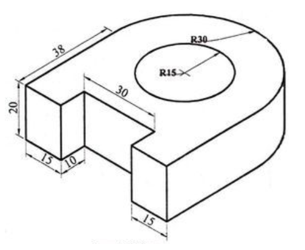
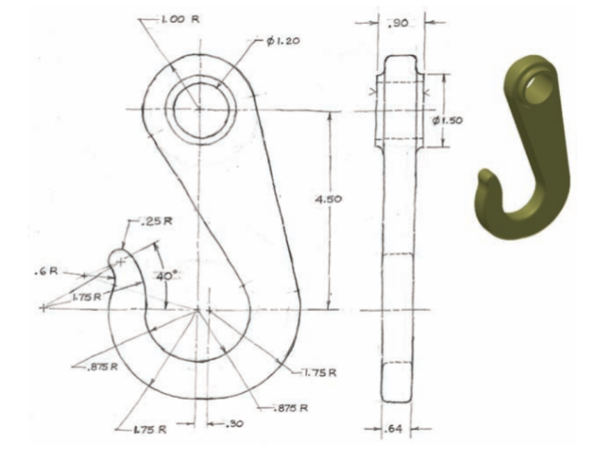
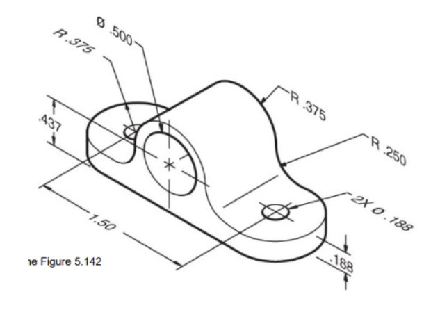
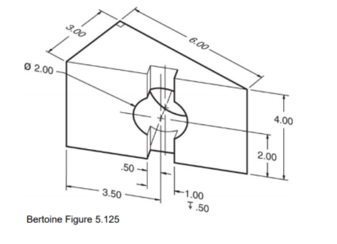

# Creating Basic Parts In Onshape

## Entering the 3rd Dimension

Once you’ve gotten a good grasp of sketching, we can exit out of the sketch environment
and move onto creating 3D objects in the features environment.
Onshape allows for two main types of modeling, solid-body, and surface.
The method covered in this document is **solid-body modeling**, which is needed to create most shapes. 

??? video "View Video Lesson: Parts Features (Extrude, Revolve, Sweep, Loft)"
    <iframe src="https://www.youtube.com/embed/DKDJHv6bWFs" allowfullscreen></iframe>

It’s important to remember that the approach to 3D modeling, like sketching, varies between person to person.
There is no “correct way” to model, but there are more **efficient ways** that eliminate the number of operations,
decreasing clutter and making your model easier to edit.

### Planes

By default Onshape provides 3 basic reference planes: the top, front, and right.
These planes help define the 3D environment, but you aren’t limited to only them.
Onshape also allows you to create your own reference planes from the 3 basic planes or from faces of existing parts. 

??? video "View Video Lesson: Creating Planes"
    <iframe src="https://www.youtube.com/embed/HD5cdKardfs" allowfullscreen></iframe>

### The Path and The Profile

Many solid-body modelling features will require both a path and a profile.
The **profile** is the sketch or flat surface that you will be extruding.
The **path** is a line or axis that guides the profile’s extrusion. 

=== "Before"
    {: align=left}
    In this image, the profile is the square and the path is the line drawn in a circular path.

=== "After"
    {: align=left}
    After the revolve function is used, the resulting part looks like this.

## Worked Example

??? video "View Video Lesson: Parts Worked Example 1"
    <iframe src="https://www.youtube.com/embed/thKXxiJ862M" allowfullscreen></iframe>

??? video "View Video Lesson: Parts Worked Example 2"
    <iframe src="https://www.youtube.com/embed/UWoLdePtZbo" allowfullscreen></iframe>

## Resources

### Practice Yourself

=== "Practice 1"
    

=== "Practice 2"
    
