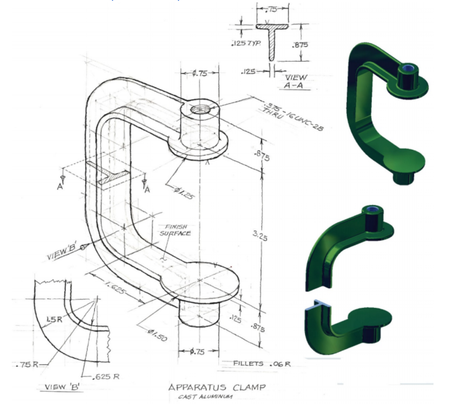
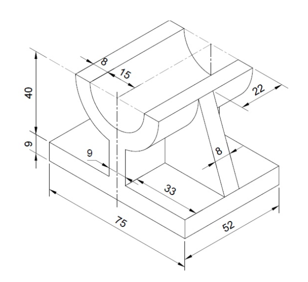
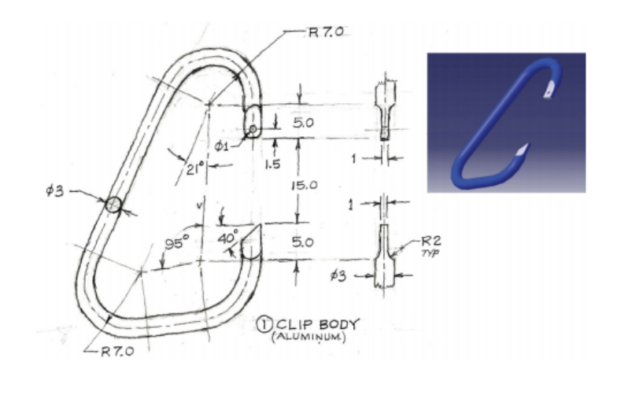

# More Complex Parts

## Other Features Tools

The extrude, revolve, sweep, and loft features make up the core of 3D modelling,
but there are a plethora of other features in Onshape. Let’s take a look at some of them here.

??? video "View Video Lesson: Parts Features 2 (Fillet, Chamfer, Draft, Rib, Shell, Hole)"
    <iframe src="https://www.youtube.com/embed/j1KawkmeXpM" allowfullscreen></iframe>

### Patterning and Mirroring in the Features Environment

Like in the sketch environment, patterning and mirroring are also possible in the features environment,
though with some slight changes.

??? video "View Video Lesson: Patterning and Mirroring"
    <iframe src="https://www.youtube.com/embed/t9oFmAo2bWQ" allowfullscreen></iframe>

### Differentiating Sketches, Extruding, and Features

It is important to understand that the typical process for CADing follows creating the model through **sketching, extruding, and adding features**.
(Extruding is a feature, but in this context we mean adding a body to your sketch)
The basic outline of the model is drawn up in the sketches environment.
Then, the model is given a rough 3D shape through the extrusion process,
which involves extruding, revolving, sweeping, lofting, etc.
Finally, the model’s details are added through the features like the fillet, chamfer, shell, hole, etc. 

This is important because features like the chamfer and fillet will
**consume or change the dimensions of the edges it has been placed on,
so if you want to reference a certain face after a feature has been applied on it**,
it will have changed. For this reason, adding features should always be done towards the end of your process.

Alright, let’s finish up learning about the features, this time with a Youtube video.

??? video "View Youtube Lesson: Parts Features 3 (Boolean, Split, Transform, Delete Part)"
    <iframe src="https://www.youtube.com/embed/C_FiDr0V0cY" allowfullscreen></iframe>

## Designing Around Machinability

As you continue CADing, you may be required to design your models for **different types of creation**,
such as printing on a 3D printer, milling on a CNC, or physical fabrication.
The document below goes more in depth on what these machines are and what to look out for when CADing models for them.

[View Design Considerations Document](https://docs.google.com/document/d/1g0QVWNLqVM_MmJ30m4VjNvOZnDCGXf7p4SFje70v6ig/edit)

!!! note "Author’s Note: The Importance of Planning and Design"
    I’ve dedicated this last section to emphasizing the importance of planning out
    your process when you are recreating CAD diagrams.
    It is ALWAYS good practice to spend a couple seconds analysing the sketches
    and think about your approach to creating it (what functions to use and in what order to use them).
    In doing this, you are likely to eliminate errors you haven’t accounted for
    and you get a better understanding of your own process, which makes troubleshooting a lot easier.
    Follow this simple step and you’ll be well on your way to becoming a CAD master!

## Worked Examples

??? video "View Video Lesson: Complex Parts Example"
    <iframe src="https://www.youtube.com/embed/7xdHrpdhbjQ" allowfullscreen></iframe>

## Resources

### Practice Yourself

=== "Practice 1"
    

=== "Practice 2"
    
