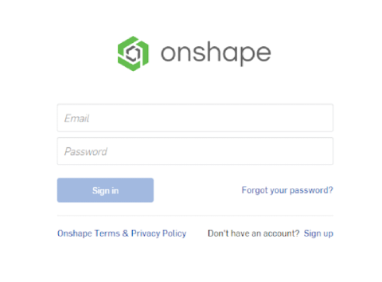

# Intro to Onshape

## Introduction

Before you get started with Onshape, it's useful to understand the whats and whys of CAD.
CAD stands for Computer Aided Design, and there are a bunch of CAD softwares out there.
Some of the more popular ones include Solidworks, Fusion 360, AutoCAD, and of course, Onshape.
Each software has their own unique features and quirks, but they accomplish the same goal:
they allow you to create detailed digital models so you can easily design, test, and iterate almost anything.

So why use Onshape? 

- First, Onshape can be **used directly from your browser**, so it's much more accessible than other CAD programs that require a dedicated installation. 
- Second, Onshape is **completely free**; other software is often very expensive. 
- Third, Onshape allows you to share your projects, so that **multiple people can work on the same project at once.** Most other softwares don’t have this feature.

Ok with that out of the way, let's talk Onshape. What is it? How do I get started?

Well, the link to the website is [here](https://www.onshape.com/en/products/free).
You’ll need to create a free account first, and to do that you’ll need to click on the “get started” button on the site.
Then follow the prompts to create and activate your account.
You may need to select the “student” option and fill in details about your school.

{: align=left}
Alternatively, you can also create an account through the sign inpage with the “sign up” option.

!!!info "Important"
    It's important to note that Onshape uses WebGL,
    so you’ll need to check your computer's graphics requirements, and be using a browser that supports it.
    You can check your computer’s requirements [here](https://cad.onshape.com/help/Content/webgl.htm#:~:text=Onshape%20is%20built%20on%20a,for%20installed%20desktop%20CAD%20programs.).

## Navigating The Workspace

Ok, once you’ve set up your account, we can move on to dissecting the interface of Onshape.

??? video "View Video Lesson: Navigating Onshape"
    <iframe src="https://www.youtube.com/embed/wPT-w8EkF4A" allowfullscreen></iframe>

Feel free to play around with the interface for a bit before you move on.
