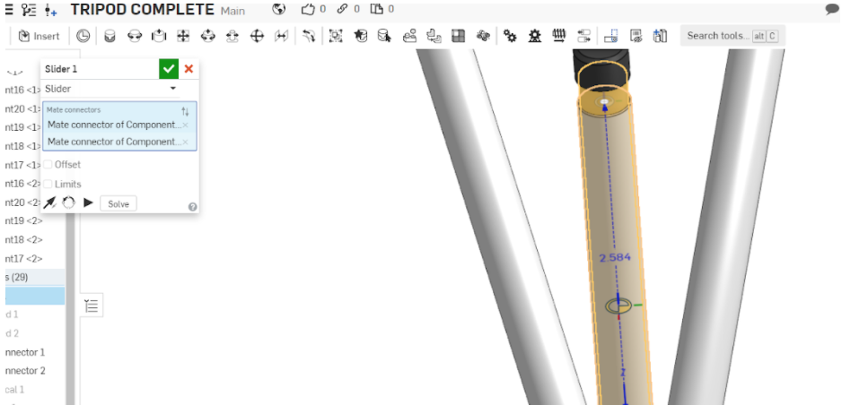
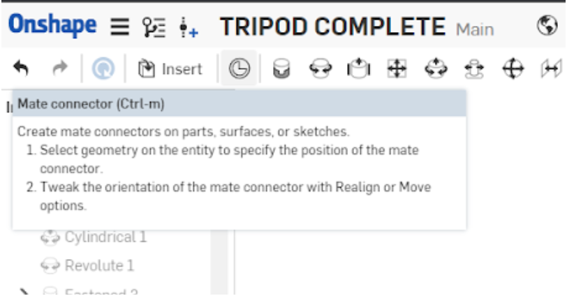
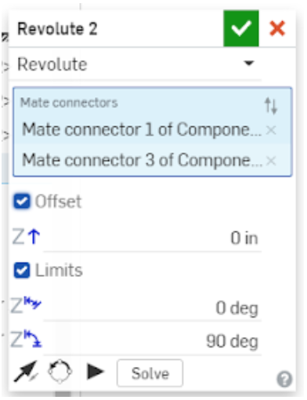
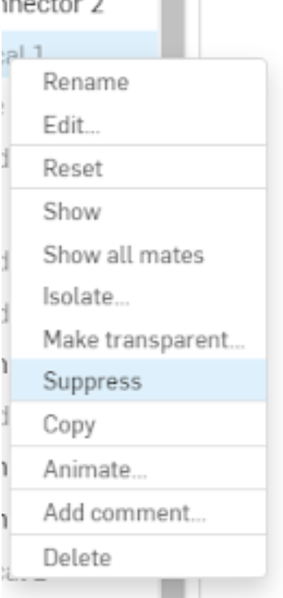
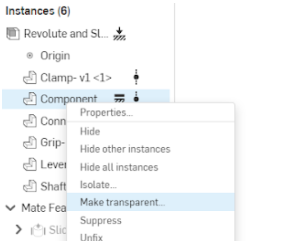
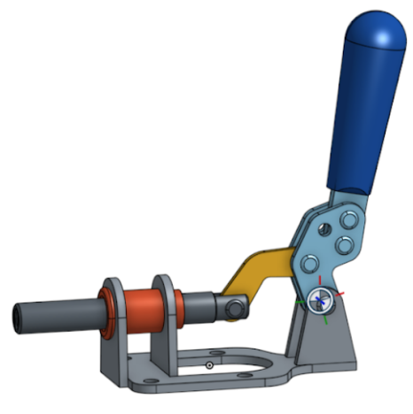
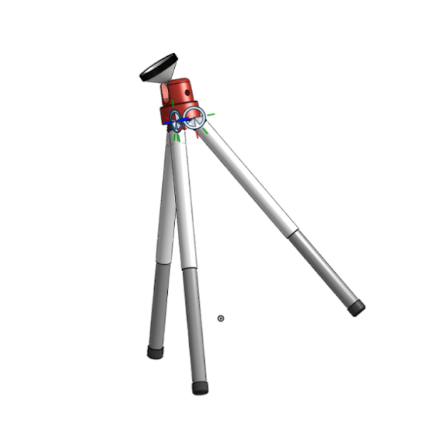

# Navigating Assemblies In Onshape

By now you should be familiar with both the sketch and features environment in Onshape.
The last environment we’ll cover is the assembly environment!
The assembly environment is used for modeling interactions between different parts,
and it allows users to build more complex objects (called assemblies) from existing parts.

??? video "View Video Lesson: Navigating the Assembly Environment (Grouping, Fixing, Inserting, Subassemblies)"
    <iframe src="https://www.youtube.com/embed/tWlYecK8ZSA" allowfullscreen></iframe>

## Mating

Mating is key to shaping the way your part studios interact with each other.
Onshape provides users with a list of mates, along with mate connectors, which allow you to define custom mating points.

??? example "View Document: Brief Overview Of Mating"
    Mating is the connection of separate parts (part studios) together to form one cohesive piece or model of a product.
    Mating on Onshape must be done in the Assembly tab. 

    Mating is done through the use of Mate Connectors.
    These are little circle icons that appear when you select a mate option in an assembly.
    Select two mate connectors while inside a mate menu and they will mate together. 

    

    Onshape automatically selects common mating positions for objects
    and creates mate connectors on them for your convenience,
    but if you want to attach an object to a place where there is no predefined mate connector,
    you can select the mate connector option and create your own. 

    

    Mates work by defining and restricting the degrees of freedom of an object.
    To find out specifics about each mate, access the document below.

    https://learn.onshape.com/learn/course/fundamentals-onshape-assemblies/mating-assembly-components/onshape-mate-types?page=3

    You can also look at the icons in Onshape itself. They show you the degrees of motion that the mate allows. 

    The fasten mate restricts all movement and so its icon has no arrows. 

    

    The revolute mate allows rotational motion only. Its icon reflects this. 

    

    Some mates will have limits, or degree values, which allow you to restrict its motion further.
    These are located in the menus of their respective mates. 

    Others may allow you to change the axis of the mate and flip it around or offset its position.

    

    You can suppress mates just like you can hide sketches by right clicking on the mate in the left menu.
    These will cancel their function in the document until you unsuppress them. 

    This is also where you can isolate them or make them transparent.

    

### Degrees of Freedom

Mates control the degrees of freedom of your part.
Every object has 6 degrees of freedom, rotational (around an axis)
and translational (up, down, left, right) in each of the three planes (top, left/right, front).
It’s difficult to keep track of which degrees/what motion a mate limits,
I’d recommend just looking at the mate icons to discern which degrees/what motion a mate allows instead. 

??? video "View Video Lesson: (Mate Connectors, All Mates, Joint Limits)"
    <iframe src="https://www.youtube.com/embed/3n93qgoqfXw" allowfullscreen></iframe>

!!! tip
    When, working with many parts, it can sometimes be difficult to select a specific part you need.
    Fortunately, you can right click on objects in the environment (or part itself on the left tab)
    and make them transparent, hide, or isolate them!
    {: align=right}

## Worked Examples

??? video "View Video Lesson: Toggle Clamp Worked Example"
    <iframe src="https://www.youtube.com/embed/lFH1mCTTQuA" allowfullscreen></iframe>

Copy the workspace for the Toggle Clamp assembly [here](https://cad.onshape.com/documents/95a49063291f28ab2cbeaa45/w/043a3faf97b34af58a71e8b5/e/6ecac82415a6578f81beeabd).

Mate your toggle clamp to have this type of motion:

<iframe src="https://www.youtube.com/embed/eND4NCzPjCg" width="400" height="225" allowfullscreen></iframe>

## Resources

### Practice Yourself

=== "Practice 1: Tripod"
    Copy the workspace for the tripod assembly [here](https://cad.onshape.com/documents/191fb4b09129a73b4f439fe8/w/fccd9e9796497034680215ee/e/ed26265e14b713152b468439).

    Mate your tripod to have this type of motion:

    <iframe src="https://www.youtube.com/embed/zdPBQobU8Cs" width="400" height="225" allowfullscreen></iframe>

    

=== "Practice 2: Grinder Vise"
    Copy the workspace for the grinder vise assembly [here](https://cad.onshape.com/documents/95a49063291f28ab2cbeaa45/w/043a3faf97b34af58a71e8b5/e/6ecac82415a6578f81beeabd).

    Mate your grinder vise to have this type of motion:

    <iframe src="https://www.youtube.com/embed/XU1lwOAGRLI" width="400" height="225" allowfullscreen></iframe>

    !!! note
        You’ll need the **screw relation** to achieve the spinning motion on the handle.
        To find and use the screw relation, you can use the search bar by pressing ++alt+c++.
        Select the function and click on an **existing cylindrical mate** to apply it,
        then input a distance per revolution value, which is 0.5 inches in the video.

    

