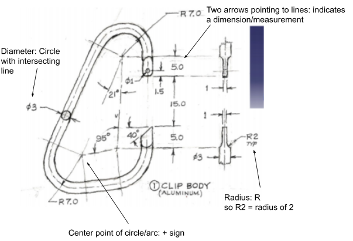
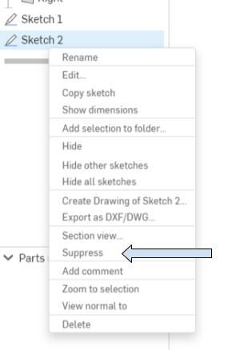
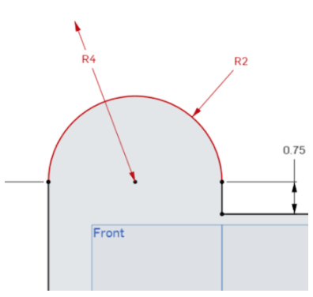
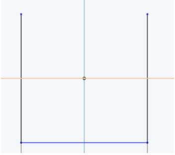

# Sketching In Onshape

## Getting Started with Sketching

So now hopefully you’re a bit more comfortable navigating around Onshape.
Let’s start working on creating sketches.

??? video "View Video Lesson: Sketching and Constraining Basics"
    <iframe src="https://www.youtube.com/embed/kizAas3Dg70" allowfullscreen></iframe>

### Constraining Objects

An important concept in any CAD software, not just Onshape, is **constraining**.
Constraining is the process of limiting or restricting the entities in your sketch.

To constrain a sketch follow the **Size, Location, Orientation process**.
Any type of sketch will need to fulfill these three conditions to be defined. 

- Size: This is a measurement of the entity itself.
- Location: This defines the entity’s position in 3D space.
- Orientation: This is the “direction” that an entity is in. 

**Relations** provide ways to quickly define a sketch entity’s size, location, and orientation.
Understanding them will help you create more detailed sketches and troubleshoot errors quickly.

??? video "View Video Lesson: Relations"
    <iframe src="https://www.youtube.com/embed/GINMe44Cdeg" allowfullscreen></iframe>

### Reading Sketches

It’s also important to be able to understand diagrams of 3D models.
Interpreting sketches can vary depending on the type of sketch, but there are certain symbols you will tend to see across the majority of drawings.
For the most part, all the information about a model can be found from its diagram, but sometimes dimensions/relations will need to be inferred.
The resources below list some of the more common symbols found in diagrams.

Now let's look at the relations we can infer from this diagram.

## Other Sketching Features and Troubleshooting

There’re a number of other sketch features in Onshape that allow you to simplify your work and decrease clutter in your sketches.

??? video "View Video Lesson: Construction Lines, Patterning, Mirroring"
    <iframe src="https://www.youtube.com/embed/G2ZIterS77k" allowfullscreen></iframe>

If at any point your sketch becomes too cluttered, you can always right click on sketches in your features tab (left side) and **suppress** it.
This will make the entity invisible until you right click on the tab again and **unsuppress** it.

## Troubleshooting Sketches

Two common issues encountered while sketching are red entities which occur when an entity is <b>over</b>defined...

=== "Overdefined Sketch"
    {: align=left}
    This entity has conflicting constraints. It has been defined as having both a 2 and 4 inch radius.

...and blue entities, which occur when an entity is <b>under</b>defined.

=== "Underdefined Sketch"
    {: align=left}
    This entity must be further constrained. It lacks both a side and bottom measurement.

Here’re some tips for troubleshooting:

- Examine the sketch and look for errors in constraining (dimensioning or relation)
- If the sketch’s name in the sketch menu and features tab is red, hover over it and check the error message. 
- If your entities are blue, pull on them and see which way they move. You may have broken an existing relation and may need to add new ones.
- Use the **undo** button or delete the entities and restart the portion of your sketch.
- Reload your webpage. Onshape can be buggy sometimes.

## Worked Example

??? video "View Video Lesson: Sketch Worked Example"
    <iframe src="https://www.youtube.com/embed/q9AcMJNUWJM" allowfullscreen></iframe>

## Resources

Here is a list of [common keyboard shortcuts in Onshape](useful-shortcuts.md).
Memorizing at least some of these as you work will improve your efficiency and save you time.

### Practice Yourself

Try creating some of these sketches on your own!

=== "Practice Sketch 1"
    

=== "Practice Sketch 2"
    
