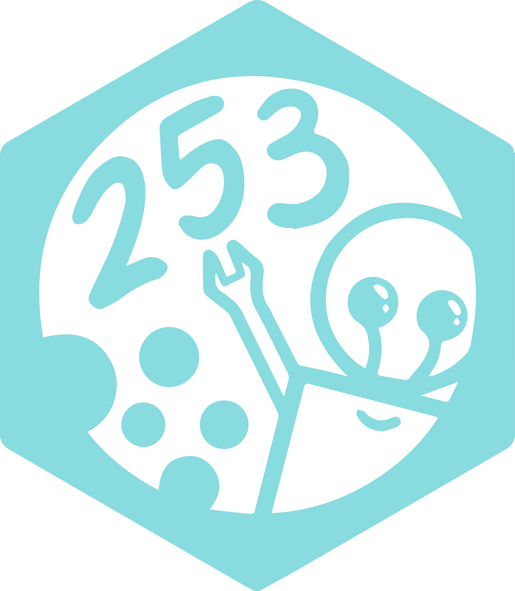

# Imagery

Welcome to the Imagery section of the Operations Department! Imagery changes every year with new designs, but this BobaDocs page will only consist of the branding standards and images of the boba brand created in 2018.

Standards for branding are crucial for creating a recognizable brand and promoting our team. These branding standards are established in order to help unify the team image, provide consistency to team merchandise and materials, and build recognition among other FRC teams and our surrounding community. In addition, we hope that our brand will inspire our students to show spirit for our team. 

Our brand focuses on a playful and passionate image. Our colors are bright and vibrant, and team imagery emphasizes hand-drawn, simple designs that convey a lighthearted energy. When used appropriately, our standards and guidelines allow for professionalism while retaining the spirit of our team. 

Due to the importance of a consistent brand, the team brand cannot be majorly changed without the agreement of team leadership. 

## Team Name

The official name is Boba Bots 253.

Acceptable nicknames include:
- Boba Bots
- Team 253
- Mills Robotics Team
- Mills Robotics
- MRT
- MRT 253

In verbal communication, the team number should be said as “two-five-three” or “two-fifty-three.” 

In written communication, the team should be referred to in plural form (“The Boba Bots are”).

The team may not be referred to by any name or nickname that does not reflect a positive team image.

## Team Logo

    

The official team logo, for use in most situations. The logo should always stand out from the rest of the page: it should be printed on a contrasting background (ideally white), and always have clearance area around it. Care should be taken to make sure the logo remains recognizable and unaltered.

Some examples of unacceptable treatments include:

- The proportions of the logo should remain the same - it may not be squashed or stretched.

- The logo should be sized appropriately, at least an inch in width when printed. 

- The logo may not be recolored.

## Alternative Logos

The alternative logos should only be used in specific situations. They Should be treated with the same requirements as the standard logo.

    

The hex logo, to be used in situations requiring a single color. This logo may only be used with approval of leadership, in specific situations.

## Team Merchandise

Team merchandise includes apparel and buttons and is redesigned every year. Apparel must include team name and number clearly visible on the front. In addition, apparel must also recognize team sponsors. Otherwise, designs may follow relaxed guidelines, but must be approved by leadership or the design team.

The team T-shirt should be printed on the Anvil Jersey T-shirt cut in Heather Carribean Blue.