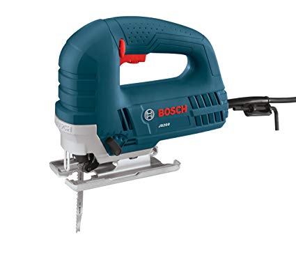
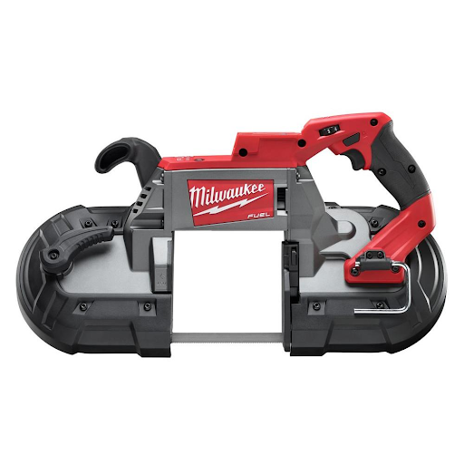
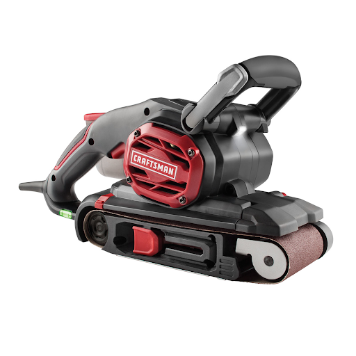
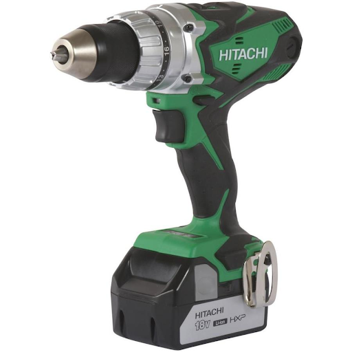
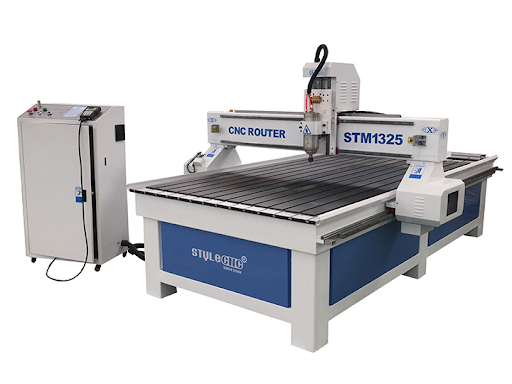

### Construction Safety Rules
These rules encompass the hazards that occur in the construction department, ranging from using the correct tool for the job to how to use tools correctly and safely. Rules are not limited to these, as different circumstances arise. 

### General Safety
* Always wear safety goggles in the construction area (the area behind the yellow and black tape) or when handling power tools
* Be mindful of your surroundings, as debris from drilling/sawing may fly around and harm others
* Do not throw any tools or materials 
* Unplug all power tools when not in use
* Do not point any power tools at anyone
* Clamp everything down properly before drilling or cutting
* Use the correct tool for the task at hand
* Remember to follow PPE rules (see above)

### Organization
* Return all tools and bits to the power tool station
* Have a clean workspace by the end of the meeting
    * This includes returning tools to their designated storage areas and vacuuming any debris that may have been created during the meeting
* Throw away any unneeded boxes or packaging

### Sanitation
* Sweep debris off tables and ground after you finish working
* Vacuum the bandsaw and drill press as well as their surrounding areas after use
* No eating, especially in work areas, if needed, eat at designated Food Table

## Guidelines for Equipment

### Jigsaw

* Used to quickly cut out pieces by hand that don’t require much detail or cannot fit in the band saw
* Always hold with two hands
* Clamp down the object that your are cutting, either with the quick-clamps or a C-clamp
* Never turn on the jigsaw while the blade is in contact with your object; let the blade move for a second before cutting
* Keep your fingers clear of the blade
* Unplug it if not in use

### Portable Band Saw

* Used for cutting straight lines in a short piece of metal or wood (e.g., pipe, 2x4)
* Always hold with two hands when in use
* Clamp down the object that you are cutting
* Keep fingers clear of the blade when the saw is turned on

### Drill Press

* Used to accurately drill holes into metal or wood
* Always clamp down the object you are drilling into
* Do not wear gloves while using the press, as it can get caught on the drill bit and cause injury
* Make sure that the drill bit is tightened and secure before turning the machine on

### Belt Sander

* Used to smooth out rough surfaces
* Hold it with two hands when in use
* Always clamp down the object you are sanding
* Do not use it on metal
* Wear earplugs or earmuffs
* Let the belt reach top speed before making contact with the object you are sanding
* Wear a facemask in order to avoid breathing in sawdust
* Empty out the sander after each use
* Never touch the sanding belt while the sander is powered on

### Circular Saw

* Used to cut pieces of metal or wood, better for straight lines
* Always clamp down the object you are cutting
* Hold it with two hands when in use
* Wear earplugs or earmuffs when using; the saw is very loud
* Let the saw run for a few seconds before cutting

### Band Saw

* Used to cut both straight lines or rough curves in pieces of metal or wood
* Wait until the blade reaches full speed before you begin cutting your object
* Do not wear gloves while using the bandsaw
* Clean out the bandsaw with a vacuum after you’re done using it; the accumulation of sawdust can cause a fire
* Always check to make sure that the right type of blade is being used when cutting metal or wood
* Unplug the bandsaw from the wall outlet when not in use
* Never turn the bandsaw on when the gates are open

### Portable Hand Drill

* Used to drill holes into wood or metal
* If drilling a large hole, start with smaller bit sizes and slowly work your way up
* If drilling into metal, make sure to use a punch on the spot you want to drill
* Always hold the drill with two hands when in use
* When not drilling, be sure that the safety is on
* Make sure that the drill bit is secure before drilling
* Always wear safety glasses

### Dremel

* Used to grind off edges on rough pieces of metal
* Be wary of kickback when using the dremel, and position yourself away from the direction of kickback
* Always wear safety goggles when using
* Anyone within a 5 foot radius must also be wearing safety goggles
* Never hold the object that you are working on and the dremel at the same time
* Always clamp the object that you are working on onto a secure surface

### CNC Router

* Used to precisely cut metal or wood. Can also be used to mill out parts
* Make sure to check oil and pressure gauges before use
* Never put any body parts inside the router when it is turned on
* Never turn of the CNC without parking it first
* Never use it without informing a mentor or administrator

### Soldering Iron

* Used to connect small metal wire together to create a circuit
* Never touch the metal tip when it is on
* Always clamp down the two wires you are soldering
* When not using the soldering iron, it should be placed in the metal rack
* Always dab the iron on the sponge when not in use

### Heat Gun

* Used to shrink heat shrink around wires to ensure that they don’t disconnect
* The silver metal nozzle at the front of the heat gun can get extremely hot. Never touch it
* The air that the heat gun produces is also extremely hot. This isn’t just like a blow dryer
* Dont point it at people ya dumb dumb