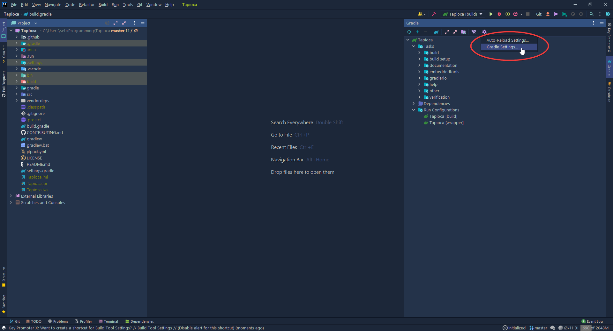
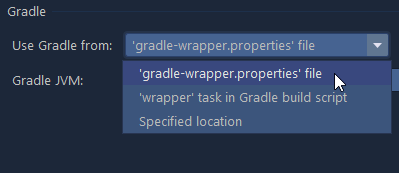
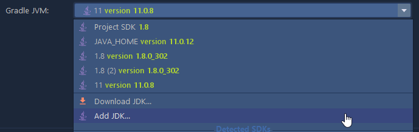
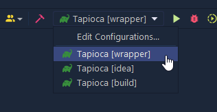

# Setup

This page should give you a comprehensive guide on setting up your environment for developing Tapioca.
If anything here doesn't work or seems incomplete, feel free to update the documentation.

If you need help with anything, don't hesitate to **ask your programming lead for help!**

## Prerequisite Installations

Things you need to have installed before you can setup.

### Git

You will need to [Install Git](https://git-scm.com/book/en/v2/Getting-Started-Installing-Git) as well as have a basic understanding of it. Git lessons can be found online or in the programming section of the bobadocs.

### WPILib

You will also need WPILib installed on the computer you plan to develop Tapioca on, even if it's not a computer you plan to develop or run robot code on. An installation guide can be found [here](https://docs.wpilib.org/en/stable/docs/zero-to-robot/step-2/wpilib-setup.html).

## Cloning

Use git to clone the Tapioca project (https://github.com/bobabots253/Tapioca). You will operate on this folder in the next sections.

## Editor

You can technically use any editor for development of Tapioca, but certain features of commonly used IDEs are very helpful when developing this project. If you're a diehard Eclipse enjoyer or Vim guru feel free to keep using what you're comfortable using.

Below are some setup steps to streamline development of Tapioca. If you're using a different IDE, you may want to figure out how to do the equivalent of the steps below.

For a guide on building Tapioca, see [building](./building.md).

### VSCode

Using your WPILib installation of VSCode is probably the most convenient way to work on Tapioca.

Simply open Tapioca with VSCode just like any other project.
If you've installed have the plugins from your WPILib installation, you're all set!

### Intellij IDEA

Intellij IDEA is a more robust IDE with a higher focus and features specifically for Java development.

When opening Tapioca as you would any other project, you might be prompted to install an unofficial "FRC" plugin. This is not necessary.

The first thing you will want to do is navigate to your Gradle settings by clicking the Gradle tab on the right, clicking the settings icon, and then clicking "Gradle Settings..."

Next, you'll want to make sure you're using gradle either from `'gradle-wrapper.properties' file` or `'wrapper' task in gradle build script`

Finally, make sure "Gradle JVM" is configured to be using JDK 11. If you don't have it as an option or you don't have it installed, don't worry! Your WPILib installation comes with JDK 11.

??? example "Using WPILib's JDK"

    Click on `Add JDK...`

    

    Then depending on your operating system, the path to WPILib's JDK will be different.

    === "Windows"

        On Windows the path to your WPILib JDK is `C:\Users\Public\wpilib\<year number>\jdk`

        For example, in the year 2021 it would be `C:\Users\Public\wpilib\2021\jdk`:

        

        Select the *folder* (Do not go inside) and then click "OK".

    === "MacOS/Linux"

        On MacOS and Linux the path to your WPILib JDK is `~wpilib/<year number>/jdk`

        For example, in the year 2021 it would be `~/wpilib/2021/jdk`.

        (On Linux `~` represents `/home/username`, and on MacOS `~` represents `/Users/username`)

        

Finally, run two of the pre-defined run configurations by selecting them from the dropdown menu at the top of your IDE and then clicking the run button. (Your icons may look different)

These tasks will generate some files that make development a lot smoother.

## Extras

This section contains explanations of what was documented above for future reference and for easy updating of the documentation in case technologies we use change.

??? info "Why does WPILib need to be installed?"

    WPILib is a dependency of Tapioca. Without the WPILib installation, you wouldn't be able to build Tapioca or install any of the vendor dependencies, and without being able to build Tapioca you wouldn't be able to test it.

??? info "Setting up your IDE"

    This is a more general guide on setting up your IDE for Tapioca development. The steps above for Intellij are just specific steps that follow the steps listed here. The WPILib installation of VSCode does most of the work for us, which is why that section is so short.

    1. Install WPILib (see the dropdown above)
    2. Make sure you're using JDK 11 (You can set JAVA_HOME with the flag `-Dorg.gradle.java.home="C:\Users\Public\wpilib\2021\jdk"` in most commands)
    3. Set up Gradle to use the wrapper (`./gradlew wrapper`)
